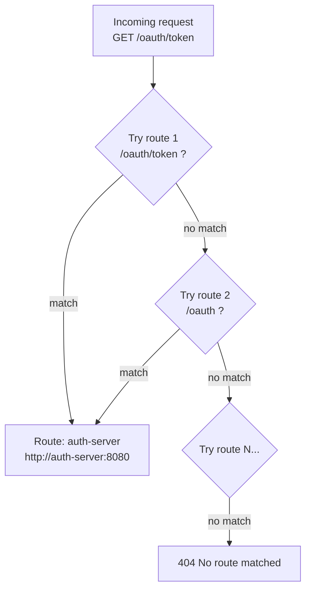
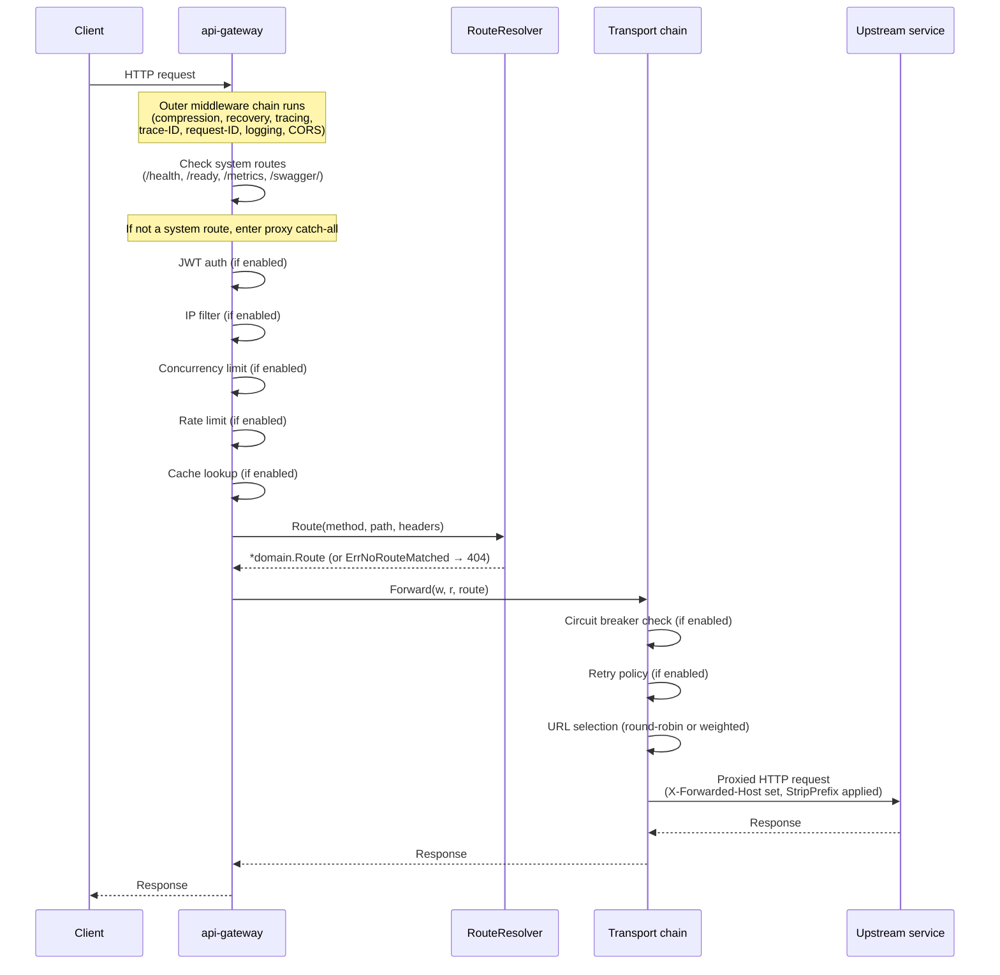
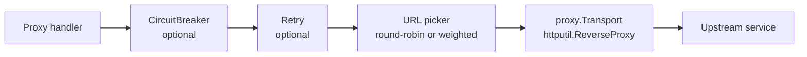
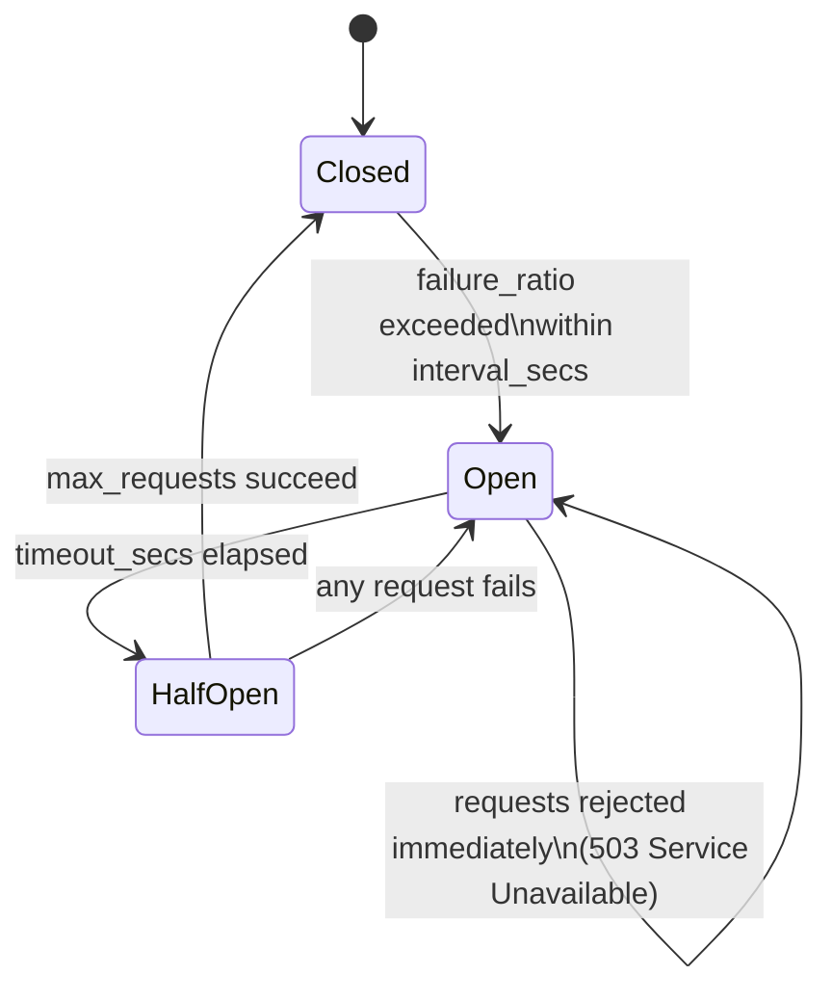
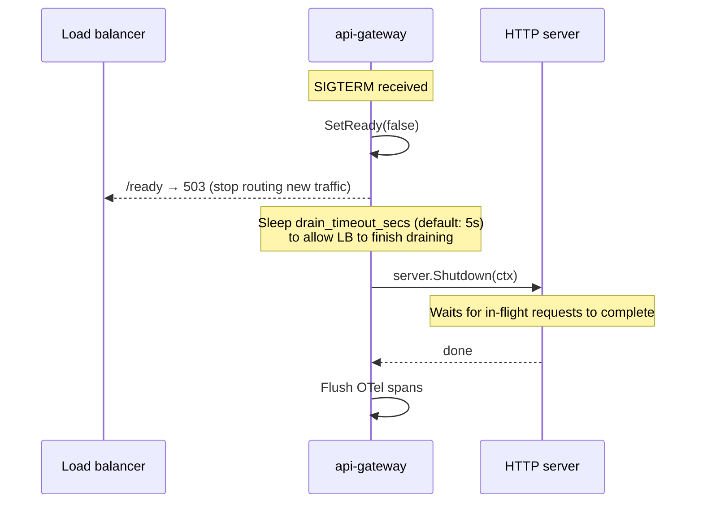

# api-gateway

The api-gateway is the single entry point for all client traffic in the identity platform. It receives every inbound HTTP request, resolves the matching upstream service using longest-prefix route matching, and forwards the request using a reverse proxy. All cross-cutting concerns — authentication, rate limiting, circuit breaking, caching, compression, retries, IP filtering, and distributed tracing — are applied as composable middleware layers that can be enabled or disabled independently via configuration.

## Quickstart

```bash
# From the monorepo root
task build                          # compile all services
./bin/api-gateway serve             # start with gateway.yaml in the current directory

# Or with docker compose (starts the full stack)
docker compose up --build
```

The gateway listens on `0.0.0.0:8080` by default. Override with `GATEWAY_SERVER_PORT`.

### System endpoints (always reachable, bypass all auth and rate limiting)

| Endpoint | Description |
|---|---|
| `GET /health` | Gateway + upstream health aggregation |
| `GET /ready` | Readiness probe (local state only; used by load balancers) |
| `GET /metrics` | Prometheus metrics |
| `GET /swagger/` | OpenAPI documentation |

---

## How routing works

### Step 1 — declare routes in `gateway.yaml`

Routes are an ordered list. Each rule maps an inbound path prefix to an upstream service URL:

```yaml
routes:
  - name: "auth-server"
    match:
      path_prefix: "/oauth"
    upstream:
      url: "http://auth-server:8080"
      timeout_secs: 10

  - name: "example-resource-service"
    match:
      path_prefix: "/resources"
    upstream:
      url: "http://example-resource-service:8085"
      timeout_secs: 10
```

### Step 2 — longest-prefix matching

At startup the gateway sorts all routes by `path_prefix` length, **longest first**. On each request the resolver scans the sorted list and returns the first match. This means a more specific prefix always beats a shorter one — `/oauth/token` wins over `/oauth` if both exist.



Matching criteria can also filter by HTTP method and required headers — all three must pass for a route to apply:

```yaml
match:
  path_prefix: "/resources"
  methods: ["GET", "HEAD"]        # only GET and HEAD; omit for any method
  headers:
    X-Tenant-ID: "acme"           # header must be present and equal
```

### Step 3 — full request lifecycle



---

## Middleware chain

Every inbound request passes through two stacked chains. The outer chain applies to all requests including system routes. The inner proxy chain applies only to forwarded requests.

```mermaid
flowchart TB
    subgraph outer["Outer chain — all requests"]
        direction TB
        CMP[CompressionMiddleware\noptional]
        REC[RecoveryMiddleware\npanic → 500]
        OTL[OTel tracing\noptional]
        TRC[TraceIDMiddleware\ninjects X-Trace-ID]
        RID[RequestIDMiddleware\ninjects X-Request-ID]
        LOG[LoggingMiddleware\nstructured JSON]
        CRS[CORSMiddleware]
        MUX[ServeMux]
    end

    subgraph system["System routes"]
        direction LR
        H[/health]
        RD[/ready]
        SW[/swagger/]
        MT[/metrics]
    end

    subgraph proxy["Proxy catch-all — forwarded requests only"]
        direction TB
        JWT[JWTMiddleware\noptional]
        IPF[IPFilterMiddleware\noptional]
        CON[ConcurrencyMiddleware\noptional]
        RL[RateLimitMiddleware\noptional]
        CAC[CacheMiddleware\noptional]
        PRX[Proxy handler\nresolve + forward]
    end

    CMP --> REC --> OTL --> TRC --> RID --> LOG --> CRS --> MUX
    MUX --> system
    MUX --> proxy
    JWT --> IPF --> CON --> RL --> CAC --> PRX
```

**Ordering rationale:**
- Auth runs before IP filter before rate limiting — invalid tokens are cheapest to reject; no token bucket consumed for unauthenticated traffic.
- Cache runs after rate limiting — rejected requests never trigger a cache lookup.
- System routes (`/health`, `/ready`, `/metrics`, `/swagger/`) are registered directly on the mux before the catch-all and therefore bypass all proxy middleware entirely.
- Compression is outermost so it can compress error responses generated by the `RecoveryMiddleware`.

---

## Outbound transport chain

Between the `Proxy` handler and the actual upstream `http.Client`, there is a second decorator stack that handles URL selection, retries, and circuit breaking:



- **URL picker** — selects one URL from the upstream pool (`urls` or `weighted_urls`) on each attempt. Retry wraps the picker so successive retries can land on different instances.
- **Retry** — re-attempts the full picker + proxy chain on transient failures (configurable status codes, exponential backoff).
- **Circuit breaker** — sits outermost; when the circuit is Open it short-circuits the entire chain and returns 503 immediately without touching any upstream.

---

## Configuration reference

All settings live in `gateway.yaml`. Every field can be overridden by an environment variable: replace `.` with `_` and prepend `GATEWAY_`. For example, `server.port` → `GATEWAY_SERVER_PORT`.

Config file search order:
1. Path in `GATEWAY_CONFIG_FILE`
2. `./gateway.yaml` (current working directory)
3. `/etc/gateway/gateway.yaml`

### Server

```yaml
server:
  host: "0.0.0.0"
  port: 8080
  tls_cert_file: ""     # path to PEM cert; both cert and key must be set together
  tls_key_file: ""      # path to PEM key
  drain_timeout_secs: 5 # Phase 1 graceful shutdown: seconds to let LB drain before server.Shutdown
```

| Env var | Default |
|---|---|
| `GATEWAY_SERVER_HOST` | `0.0.0.0` |
| `GATEWAY_SERVER_PORT` | `8080` |
| `GATEWAY_SERVER_TLS_CERT_FILE` | _(empty)_ |
| `GATEWAY_SERVER_TLS_KEY_FILE` | _(empty)_ |
| `GATEWAY_SERVER_DRAIN_TIMEOUT_SECS` | `5` |

### Logging

```yaml
log:
  level: "info"         # debug | info | warn | error
  format: "json"        # json | text
  environment: "development"
```

### Routes

Routes are the core of the gateway. The first matching rule wins (longest-prefix order).

```yaml
routes:
  - name: "my-service"          # unique; used in metrics and logs
    match:
      path_prefix: "/api"       # required; matches any path starting with /api
      methods: ["GET", "POST"]  # optional; omit to allow any method
      headers:                  # optional; all listed headers must match exactly
        X-Version: "v2"
    upstream:
      url: "http://my-service:8080"   # single upstream (use urls: or weighted_urls: for LB)
      strip_prefix: "/api"            # remove this prefix before forwarding; optional
      timeout_secs: 10                # per-route deadline; 0 = use shared client timeout (30s)
      websocket: false                # set true for WebSocket / SSE / gRPC-web upstreams
      cache_ttl_secs: 0               # per-route cache TTL override; 0 = global default
```

#### Load balancing

Use `urls` for round-robin or `weighted_urls` for weighted distribution. `url` is ignored when either is set.

```yaml
# Round-robin across two instances
upstream:
  urls:
    - "http://svc-1:8080"
    - "http://svc-2:8080"

# Canary: 75% primary, 25% canary
upstream:
  weighted_urls:
    - url: "http://svc-primary:8080"
      weight: 3
    - url: "http://svc-canary:8080"
      weight: 1
```

#### Header manipulation

Apply per-route header rules to outgoing requests or incoming responses:

```yaml
upstream:
  header_transform:
    request:
      set:
        X-Gateway-Version: "1"    # always overwrite
      add:
        X-Request-Source: "gw"    # write only if absent
      remove:
        - X-Internal-Token         # strip before forwarding to upstream
    response:
      remove:
        - X-Powered-By             # strip from upstream response before sending to client
```

#### Per-route mTLS

```yaml
upstream:
  tls:
    ca_file: "/certs/ca.pem"       # custom CA to verify the upstream's certificate
    cert_file: "/certs/client.pem" # client certificate for mutual TLS
    key_file: "/certs/client.key"
    # insecure_skip_verify: true   # disables cert verification — development only
```

#### Per-route retry override

```yaml
upstream:
  retry:
    enabled: true
    max_attempts: 5
    initial_backoff_ms: 50
    multiplier: 2.0
    retryable_status: [502, 503, 504]
```

### Authentication

JWT Bearer token validation applied to the proxy catch-all. System routes always bypass it. Paths listed in `public_paths` also bypass it.

```yaml
auth:
  enabled: false
  type: "hs256"           # hs256 (HMAC-SHA256) | jwks (RS256 via JWKS endpoint)
  signing_key: ""         # hs256 only — inject via GATEWAY_AUTH_SIGNING_KEY; never commit
  jwks_url: ""            # jwks only — e.g. "https://auth.example.com/.well-known/jwks.json"
  jwks_refresh_secs: 300  # jwks only — key set refresh interval
  issuer: ""              # validate iss claim when non-empty; applies to both types
  audience: ""            # validate aud claim when non-empty; applies to both types
  public_paths:
    - "/auth/login"
    - "/auth/register"
```

**hs256** — HMAC-SHA256 shared secret. Fast, no external calls. Requires the same key in every service that issues tokens.

**jwks** — RS256 via a JWKS endpoint. The gateway fetches and caches the public key set; a background goroutine refreshes it every `jwks_refresh_secs` seconds. Compatible with any OIDC-compliant issuer.

### Rate limiting

Six strategies are available. All are keyed per client; the key source is configurable.

```yaml
rate_limit:
  enabled: false
  strategy: "token_bucket"  # see table below
  key_source: "ip"          # ip | x-forwarded-for | x-real-ip | header:<name> | jwt-subject
```

| Strategy | Parameters | Notes |
|---|---|---|
| `token_bucket` | `requests_per_second`, `burst_size` | Default. Allows short bursts; good general-purpose choice |
| `fixed_window` | `requests_per_window`, `window_secs` | Simple; has boundary spike at window edge |
| `sliding_window_log` | `requests_per_window`, `window_secs` | Most accurate; O(N) memory per client |
| `sliding_window_counter` | `requests_per_window`, `window_secs` | O(1) memory, ~0.003% error (Cloudflare algorithm) |
| `leaky_bucket` | `drain_rate_per_second`, `queue_depth` | Reject-only; enforces constant drain rate, no bursts |
| `concurrency` | `max_in_flight` | Limits simultaneous in-flight requests, not rate |

> **Production note:** `key_source: "ip"` uses `RemoteAddr`, which is the load balancer's IP in a typical deployment. Use `"x-forwarded-for"` or `"x-real-ip"` so each end-user gets their own bucket.

### Circuit breaking

Three-state machine applied per route name. Protects upstreams from thundering-herd failures.

```yaml
circuit_breaker:
  enabled: false
  failure_ratio: 0.6    # open when ≥ 60% of requests fail (minimum 5 requests sampled)
  interval_secs: 60     # failure counting window; 0 = count since last state transition
  timeout_secs: 30      # seconds in Open state before moving to Half-Open
  max_requests: 1       # probing requests allowed in Half-Open state
```



### Caching

In-memory LRU + TTL cache for upstream responses. Only `GET` and `HEAD` requests with `200 OK` responses are cached.

```yaml
cache:
  enabled: false
  max_entries: 1000       # max cached responses; evicts LRU when full
  default_ttl_secs: 60    # global TTL; override per-route with upstream.cache_ttl_secs
```

Cache key = `method + path + query string + Accept header`.

### Retries

Exponential backoff on transient upstream failures. Each retry may land on a different upstream instance when load balancing is active.

```yaml
retry:
  enabled: false
  max_attempts: 3           # total attempts including the first; must be ≥ 2 for any retries
  initial_backoff_ms: 100   # wait before first retry; doubles each attempt (capped at 30s)
  multiplier: 2.0
  retryable_status:
    - 502
    - 503
    - 504
```

### Compression

Gzip response compression. Applied outermost so even error responses from panic recovery are compressed.

```yaml
compression:
  enabled: false
  min_size_bytes: 1024   # skip compression for small responses (avoids header overhead)
  level: 6               # 1 (fastest) to 9 (best compression); 6 is the gzip standard default
```

### IP filtering

CIDR-based access control applied to every proxied request.

```yaml
ip_filter:
  enabled: false
  mode: "deny"           # deny: block listed CIDRs | allow: only permit listed CIDRs
  cidrs:
    - "10.0.0.0/8"
    - "192.168.0.0/16"
  key_source: "ip"       # same options as rate_limit.key_source
```

### Distributed tracing

OpenTelemetry span creation and W3C TraceContext propagation.

```yaml
tracing:
  enabled: false
  service_name: "api-gateway"   # OTel resource attribute "service.name"
  exporter: "stdout"            # stdout (local dev) | otlp (Jaeger, Grafana Tempo, etc.)
  otlp_endpoint: ""             # e.g. "otel-collector:4318"; only used when exporter=otlp
```

`OTEL_EXPORTER_OTLP_ENDPOINT` overrides `otlp_endpoint` at runtime.

---

## Graceful shutdown

The gateway uses a two-phase shutdown sequence to avoid dropping in-flight requests:



**Phase 1** — `/ready` returns 503 immediately after `SetReady(false)`. The load balancer sees this and stops routing new traffic to this instance. In-flight requests continue to be served.

**Phase 2** — after `drain_timeout_secs`, `server.Shutdown` is called. It waits for in-flight handlers to return before closing connections.

---

## Internal architecture

The gateway follows [hexagonal architecture](../../docs/adr/0001-use-ports-and-adapters.md). Dependencies flow inward only:

```
domain  ←  application  ←  ports  ←  adapters
```

| Layer | Package | Responsibility |
|---|---|---|
| Domain | `internal/domain` | `Route`, `UpstreamTarget`, `MatchCriteria` — pure Go types, no external imports |
| Application | `internal/application` | `RouteResolver` (longest-prefix matching), `GatewayService`, `HealthAggregator` |
| Ports | `internal/ports` | Interface definitions: `RequestRouter`, `UpstreamTransport`, `RateLimiter`, `TokenVerifier`, etc. |
| Inbound adapters | `internal/adapters/inbound/` | HTTP handler, middleware chain, JWT verifiers |
| Outbound adapters | `internal/adapters/outbound/` | `proxy.Transport` (reverse proxy), rate limiters, circuit breaker, retry, LB pickers, health checker, cache, metrics |
| Container | `internal/container` | Wires all concrete adapters together (DI root; Facade pattern) |
| Config | `internal/config` | YAML + env var loading, validation, translation to domain types |
